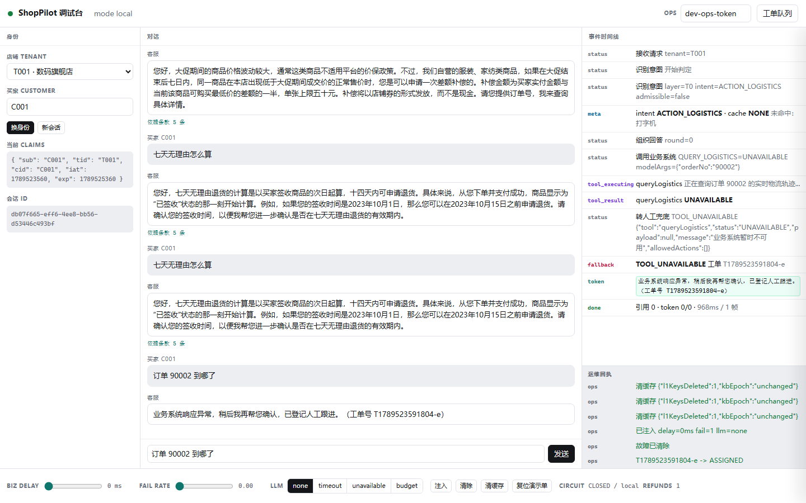
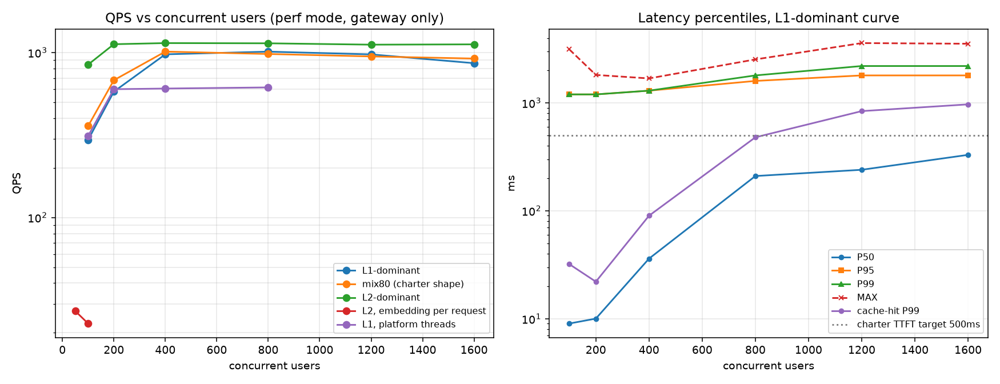
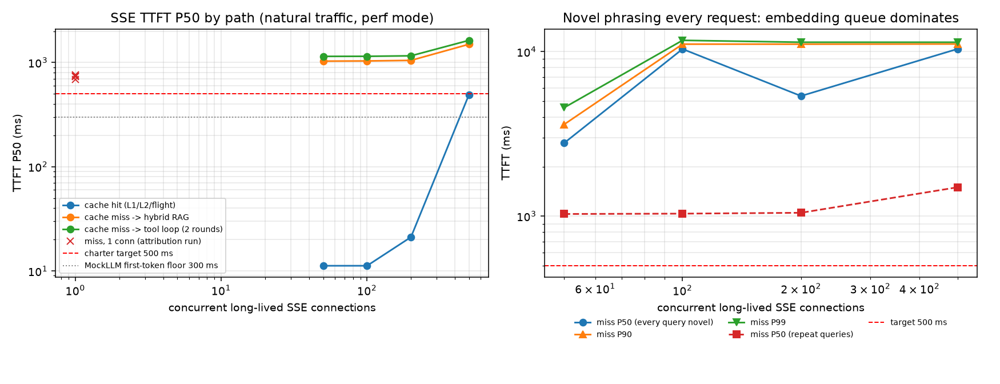

# ShopPilot

面向电商大促的高并发智能客服与业务网关：**静态政策 RAG + 动态业务 Tool Calling + 两级缓存 + 降级工单**，
跑在 Java 21 虚拟线程与 Spring Boot 3.3.5 上。

它要回答的不是"能不能对话"，而是大促洪峰下的四个工程问题：重复热点怎么不进模型、
对话怎么真的改成订单、语义缓存怎么不把反义问句串到一起、外部依赖挂了怎么兜住。

四个问题的答案都在下面，而且每条都带实测数字与证据文件——**没达成的也照写**。

| | |
| --- | --- |
| 命中路径 P99 | **22 ms**（200 并发，perf 模式；100 并发 32 ms，400 起进入排队） |
| 缓存总拦截率 | **74%**（L1 主导模型）/ **78%**（任务书 80% 命中口径）— 判据 ≥80%，**未达成**，归因见下 |
| 吞吐峰值 | **1013 QPS** @800 并发，错误率 0% — 判据 ≥1200，**未达成**，归因见下 |
| Token 节约率 | **62.4%**（实测，不是任务书里的 75%） |
| 虚拟线程收益 | 400-800 并发 **+64%**；100-200 并发无收益 |
| 降级路径 | 7 种 reason 全部可脚本复现，且每种都落成可查工单 |

完整口径与逐条对照：[docs/loadtest-report.md](docs/loadtest-report.md)、[docs/threshold-calibration.md](docs/threshold-calibration.md)。



## 快速开始（一条命令）

前置：Docker Desktop、JDK 21、Ollama、PowerShell 7（`pwsh`）。中间件端口全部偏移并只绑 `127.0.0.1`，
不会和你机器上的别的项目抢 6379/6333/9200/8080。

```powershell
git clone <本仓库> ShopPilot; cd ShopPilot
pwsh -NoProfile -File scripts/up.ps1          # 起中间件 -> 拉模型 -> 构建 -> seed -> 入库 -> 起服务
start http://127.0.0.1:8082                   # 调试台
```

`up.ps1` 里每一步都可重入：容器已在跑就跳过，seed 非空即跳过，入库是幂等 upsert。
就绪判定用 Spring Boot 的 readiness 健康组（`/actuator/health/readiness`）：`ApplicationRunner`
跑完之前端口已经开着，但 `/actuator/health` 会返回 503 `OUT_OF_SERVICE`，脚本因此不会在
biz-mock 还在 seed 5 万单、网关还在预热 bge-m3 的时候就把流量放进来。
要停：`pwsh -NoProfile -File scripts/down.ps1`（加 `-Containers` 连中间件一起停，数据卷保留）。

<details>
<summary>手动分步（想知道 up.ps1 到底干了什么，或者不想用 pwsh）</summary>

```powershell
docker compose up -d                              # Redis 16379 / Qdrant 16333 / ES 19200
ollama pull bge-m3                                # embedding，1024 维，全程恒定
ollama pull qwen2.5:3b                            # local 模式的生成模型
mvn -o -DskipTests package                        # 干净机器去掉 -o 联网取依赖；或用 .\mvnw.cmd
pwsh -NoProfile -File scripts/start-bizmock.ps1   # :8091，seed 3 租户 / 200 买家 / 5 万订单
pwsh -NoProfile -File scripts/ingest.ps1          # 30 篇政策 -> 90 规则块 -> ES + Qdrant，推进 kb_epoch
pwsh -NoProfile -File scripts/start-gateway.ps1 -Profile local
```

三种运行模式（ADR 0001）：`local` = Ollama `qwen2.5:3b`（默认，演示与降级验证）、
`dev` = DashScope `qwen-plus`（工具调用准确率评测，需要 `Copy-Item .env.example .env` 填
`SHOPPILOT_LLM_API_KEY`）、`perf` = `MockLLMClient` 固定延迟（压测，只衡量网关编排层）。
换模式：`pwsh -File scripts/start-gateway.ps1 -Profile dev`。
`.env` 由启动脚本读进来注入服务进程（Spring Boot 自己不认 `.env`），
已经导出到环境里的同名变量优先，所以 CI 与实验脚本不需要 `.env` 也能覆盖配置。

</details>

## 三条演示

```powershell
pwsh -NoProfile -File scripts/demo.ps1                 # 三条连着跑
pwsh -NoProfile -File scripts/demo.ps1 -Which cache    # 只看一条：cache | isolation | fallback
```

1. **缓存拦截**：同一句"发什么快递"问两次。第一次打模型，第二次 `cacheLayer=L1`，
   脚本当场把 `shoppilot_llm_calls_total` 的前后增量打出来——命中路径的模型调用增量是 0。
2. **串号防线**：A 店买家问自己的 `90001`，B 店买家问同一个单号。B 店只得到"未在本店找到该订单"，
   不返回 403（403 等于承认这单存在）；伪造 token 直接 401；body 里塞 `tenantId` 被忽略并告警。
3. **降级转人工**：现场注入 `failRate=1.0`（经网关运维代理，脚本碰不到 biz-mock 的内部凭证），
   下一次物流查询不返回 500，而是同一条 SSE 通道里推 `fallback{reason=TOOL_UNAVAILABLE, ticketId}`，
   随后按工单号能从队列里读回这条工单。

界面版演示：浏览器开 `http://127.0.0.1:8082/`，右侧时间线逐帧显示状态机转移，
底部滑块就是同一个故障注入接口，右上抽屉是工单队列（认领/结单可点）。

## 架构

```
                浏览器 / App  （只跟 :8082 同源说话）
                          |
                 +--------v---------+
                 |  网关 :8082      |  Java 21 虚拟线程 / Spring Boot 3.3.5
                 |  AuthFilter      |  HS256 验签 -> TenantContext（身份只来自 token）
                 |  限流            |  Redisson 令牌桶：店铺配额 + 买家/IP，判定在编排之前
                 |  AgentStateMachine|  10 状态显式枚举，SSE 帧由转移产生
                 +---+----+----+----+
                     |    |    |
     L1 Redis 精确哈希  |    |   +--> Qdrant 1024 维  ┐
     L2 向量语义缓存 ────┘    |     ES BM25 倒排     ┴─ RRF(k=60) 混合检索 -> top5 注入 Prompt
                             |
                    +--------v---------+        HTTP + X-Internal-Token（跨进程边界，ADR 0002）
                    | biz-mock :8091   |        H2 + Spring Data JPA，@TenantId 行级隔离
                    | orders logistics coupons refunds tickets
                    +------------------+
```

| 层 | 选型 | 为什么是它 |
| --- | --- | --- |
| 网关与编排 | Java 21 + Spring Boot 3.3.5 | 虚拟线程让"每个请求一路阻塞式 HTTP"在 IO 密集下不再吃线程池（实测 +64%） |
| 意图与工具 | 自研 10 状态机 + Function Calling | 三级级联判定（规则 / 质心 / 模型），工具循环硬上限 2 轮（ADR 0007、0008） |
| 缓存 | Redis 7 + Qdrant | L1 零向量化才能守住 30 ms；L2 带 `tenant/scope/intent/kb_epoch` 强制过滤（ADR 0003） |
| 检索 | Qdrant 稠密 + ES 倒排 + RRF | 双引擎各有短板，融合成本 60 行代码（ADR 0010） |
| 业务侧 | H2 + Spring Data JPA | Mock 的是业务系统而不是业务逻辑：状态机、归属校验、幂等约束都是真的 |
| 通道 | Spring MVC `SseEmitter` | 单向推流 + 断线重连够用；POST SSE 需要自带读流（浏览器 `EventSource` 不支持 POST） |
| 模型依赖 | dev / local / perf 三模式 | 数字归属清晰：吞吐类指标只算编排层，推理成本另开一条曲线（ADR 0001） |

## 请求主链路

```
INTAKE      验签 -> TenantContext；归一化；实体正则扫描
TRIAGE      T0 规则 -> T1 向量质心 -> T2 模型（仅不确定时），10 意图，动作优先
            显式「转人工」在 T0 定案：不碰 embedding，向量服务超时也转得出去（ADR 0017）
            不确定即不准入缓存（fail-closed）
CACHE_READ  仅政策意图：L1 精确哈希（零向量化）-> miss 才向量化 -> L2 语义
            key = MD5(tenantId + scope + intent + kbEpoch + normalizedQuery)
            L2 filter = {tenant_id, scope, intent, kb_epoch}，cosine >= 0.95 + 极性守卫
RETRIEVE    Qdrant dense top20 + ES BM25 top20 -> RRF(k=60) -> top5
PLAN        tools 全量下发，模型返回 tool_call 即意图证据，全程一次模型请求
TOOL_EXEC   HTTP -> biz-mock，超时/熔断，硬上限 2 轮
SLOT_ASK    必填槽位缺失就追问，绝不猜订单号；两轮拿不到 -> 转人工
REPLY       流式输出 -> done 带 citations
CACHE_WRITE 异步写回，先过七道资格判定（降级话术、空答案、用过工具的都不写）
FALLBACK    7 种 reason -> 落可查工单
```

命名约定：`L1`/`L2` 只指缓存两级，`T0`/`T1`/`T2` 只指意图判定三级，两套序号不混用。

SSE 事件契约（10 个事件，客户端判定失败的唯一依据是"没收到 `done`"）：

```
meta | status | token | done | tool_executing | tool_result
slot_ask | fallback | duplicate_submit | rate_limited
```

## 指标与口径

**这张表逐条写"怎么量的"，未达成的照写未达成。**所有数字来自 `loadtest/results/` 下的产物，
表格由 `python scripts/build_loadtest_report.py` 生成，本文不誊写第二个数字。
吞吐与延迟类指标衡量的是**网关编排层**，生成侧是固定延迟的 Mock，不含模型推理（ADR 0001）。

| 指标 | 判据 | 实测 | 口径 | 证据 |
| --- | --- | --- | --- | --- |
| 缓存总拦截率 | ≥80% | **73.2%-74.0%** | (L1+L2+穿透合并)/有效请求，计数器差值；L1 主导模型，100-1600 并发 | `ladder-l1-perf-20260908-231233-final.csv` |
| 同上（任务书口径） | ≥80% | **77.8%-78.2%** | 80% 热点重复 + 10% 业务 + 10% 长尾 | `ladder-mix80-perf-20260908-233023-final.csv` |
| 命中路径 TP99 | <30 ms | **32 / 22 / 90 / 480 / 840 / 970 ms**（100/200/400/800/1200/1600 并发）；SSE 侧独立复核 P99 45 / 48 / 123 / 603 ms（50/100/200/500 长连接） | 派生事件 `cache[hitpath]` 分位数；该路径模型与远程向量化增量恒为 0。SSE 复核是客户端口径，含环回与线程调度，比服务端略高属正常 | 同上 + `verify-hit-zero-llm.ps1` + `sse-ttft-*-sweepmix.csv` |
| 未命中 TTFT（知识路径） | <500 ms | **未达成**：P50 690 ms（1 并发串行）→ 1031 / 1036 / 1049 ms（50 / 100 / 200 并发）→ 1499 ms（500 并发） | 客户端发请求→第一个 `event: token` 帧；样本只取 `meta.cacheLayer=NONE` 且非动作意图（`scripts/run_sse_ttft.py` 分桶）；perf 的 Mock 首字固定占 300 ms | `sse-ttft-20260909-151606-1-attrib.csv`、`sse-ttft-20260909-144654-50-sweepmix.csv` 等 4 份 |
| 未命中 TTFT（动作路径） | 不设判据 | P50 1146 / 1148 / 1160 / 1634 ms（50→500 并发） | 动作意图按设计要走两轮工具调用，perf 下每轮 Mock 各 300 ms，与 500 ms 不是同一预算，故单列不并入上一条 | 同上（`action_*` 列） |
| 未命中 TTFT 的归因 | 报出谁花的 | 服务端 TTFT 均值 725 ms = Mock 首字下限 300 + 本机单条新问句向量化 311 + 稠密检索 4.8 + 词法检索 5.8 + **编排余量 104 ms** | 单连接串行、网关刚重启（服务端计时器按进程累计）；向量化那一步服务端没有计时器包住，由探针实测 | `ttft-attribution-20260909-151609-1conn.csv`、`probe_embedding_latency.py` |
| 吞吐极限 | ≥1200 QPS 且错误率<0.1% | **1013 QPS**@800（L1 主导）/ **1141 QPS**@400（L2 主导），错误率 0% | `qps_scope=chat-only`，Locust 4 进程同机发压 | `ladder-l1-…-final.csv`、`ladder-l2-…-l2.csv` |
| L2 路径吞吐 | 报天花板与归因 | **23.8-64.8 QPS**（每请求真打 bge-m3）vs 同档 845-1141 QPS（有进程内向量缓存），同并发差 **18-36 倍** | profile `perf,no-embedding-cache`，`embed_cached` 全程 0、远程向量化≈非命中请求数（L1 命中不需要向量）；生产侧解法见 ADR 0011：embedding 拆独立批处理服务 + 向量缓存命中率当一等指标 | `ladder-l2-perf,no-embedding-cache-20260909-133010-l2emb.csv` |
| 虚拟线程收益 | 开关两组 | 400 并发 **+64%**、800 并发 **+65%**；100 并发 -3%、200 并发 -3% | 同模型同并发，只关 `spring.threads.virtual.enabled` + 200 平台线程池 | `ladder-l1-perf,no-virtual-20260909-011351-novirtual.csv` |
| Token 节约率 | 关缓存基线对比 | **62.4%**（1096.8 → 412.3 token/请求）；拆开：穿透合并单独省 50.3%，缓存再省 24.4% | perf 模式 `shoppilot_llm_tokens_total` 差值/请求数，三档只差防线开关；token 由 Mock 按模板估算 | `ladder-l1-perf,nocache,nosf-…`、`ladder-l1-perf,nocache-…`、`ladder-l1-perf-…-cacheton.csv` |
| 工具调用准确率 | 分意图选对工具与填对参数各 ≥95% | **dev 模式实测（DashScope `qwen-plus`，180 条）**：修复前 选对工具 157/180 = 87.2%、填对参数 46/63 = 73.0%（ADDRESS 66.7%、ORDER 72.2%、REFUND 72.2%）；按这一轮暴露的四组缺陷修完（工具集不再按子意图裁到单个、可选参数改默认值、改地址支持部分更新、"承诺办理却没调工具"加一次纠偏轮，见 ticket 16）之后 **选对工具 168/180 = 93.3%、填对参数 57/63 = 90.5%**。分意图（选对工具/填对参数）：POLICY 四行 100%、LOGISTICS 100/100%、ADDRESS 94.4/93.3%、REFUND 94.4/93.8%、ESCALATE 88.9%、UNKNOWN 83.3%、**ORDER 72.2/75.0%（最低行，原因见"已知限制"）** | 180 条人工校对用例（10 意图 × 18），对抗样本实测 40%；缺槽位的期望是追问而不是猜。模式口径：dev = 云端 qwen-plus；local 的 3B 数字留在 ticket 16 作对照，不混进这一格。POLICY 四行与 LOGISTICS 行取自全量那一轮（这两组的 `fallback` 列逐条为空），其余五行按意图补跑——全量那一轮跑到第 137 条把 ADR 0012 的日预算用完，剩下 43 条一律 `LLM_BUDGET_EXCEEDED` 转人工，不进统计；ACTION_ORDER 行在全量与补跑里逐格一致，说明它不是抖动 | `tool-eval-20260910-075747-dev*`（全量：修复前基线另见 `071643-dev*`）、补跑 5 份 `tool-eval-20260910-080[6-9]*-dev-budgetfix*` |
| 语义缓存阈值 | 0.85-0.99 扫描 + 反义对不互命中 | 0.95 工作点**召回实测 0**；同桶反义最大余弦 **0.9682**，由极性守卫兜 | 118 组对抗对，向量层与系统层分开报 | `docs/threshold-calibration.md`、`docs/threshold-sweep.csv` |
| 混合检索质量 | hybrid 优于 dense-only | 16/16 与 16/16：**该语料上两者打平**，dense 已全中 | 同一次检索里两路前 5 对期望文档的命中名次 | `docs/retrieval-comparison.md` |
| HikariCP 饱和点 | 记录饱和点与调池前后差异 | 池 2/10/30 三档 QPS 差 **≤1.2%**；池=2 时 pending 峰值 39、获取均值 6.5 ms，池=10 起 pending 全程 0 → **任务书"默认 10 连接先于 CPU 饱和"未被实测支持** | 流量模型 `biz`（100% 业务办理），每档 45 s，池大小经 `hikaricp.connections.max` 反读确认 | `ladder-biz-perf-20260909-033940-pool2.csv` 等三份 |
| 写操作幂等 | 100% | 50 并发同 token → 库里 1 行；绕过网关直插由 DB 唯一约束拒 | 幂等键四元组 + `uk_refund_idempotency` | `verify-idempotency.ps1`、`TenantIsolationAndIdempotencyTest` |
| 降级路径 | 每种可复现且落工单 | **7/7** 帧内 ticketId 都能在工单队列里查回 | 故障注入全部经网关运维代理；脚本对每个工单号做队列反查 | `verify-fallback.ps1`、`FallbackReasonTest` |
| 可复现性 | 新机器照 README 一条命令起栈并跑通三条演示 | **同机干净检出达成，异机未验**：`git clone` HEAD → 空数据卷 + 无 `.env` → `up.ps1 -Profile local` 一次通过（118 s，含冷构建、5 万单 seed、90 块全量入库）→ `demo.ps1` 三条演示全过（105 s） | 起栈脚本按"中间件→模型→构建→seed→入库→网关"顺序等 health，每步可重入；克隆目录里没有 `.env`，说明 local 模式所需配置全在仓库内。**仍是同一台物理机**：换机未验，本机另有两个项目的容器在抢内存，见下方"干净检出检查" | `scripts/clean_clone_check.ps1`、`logs/clean-clone-check-20260910-034422.log`、`scripts/up.ps1`、`scripts/demo.ps1` |



阶梯图由 `python scripts/plot_loadtest_curves.py` 生成，读的是 `loadtest/results/` 里同一批阶梯 CSV。
左图对数轴上三条带缓存的曲线在 1000 QPS 附近压平；往下依次是关掉虚拟线程（615）、向量服务停用（482），
最下面那条"每请求真打一次 bge-m3"只有 24-65 QPS——这三条落差就是编排之外的东西吃掉的性能。



首字图由 `python scripts/plot_ttft_sweep.py` 生成，读 `loadtest/results/sse-ttft-*-sweep{mix,miss}.csv`。
左栏三条线各自的形状就是结论：**未命中那条几乎是水平线**（1031→1049 ms），说明它慢不是因为排队，
而是每个请求自己就值这么多毫秒；命中那条在 200 并发内贴着 11-21 ms，到 500 并发才抬到 492 ms——
同机争抢只解释最后那一点。右栏是"每次都是全新问法"：向量化在本机 Ollama 上排队，
100 并发起首字直接进秒级（P50 10.4 s），这条就是 ADR 0011 那句话的图像版。

未达成的三条（拦截率、吞吐、TTFT）归因写在一起，不逐行重复：

- **拦截率 74-78% 而不是 80%**：分母里 15% 业务办理 + 15% 长尾按设计根本不准入缓存（动作意图进缓存等于把
  一次性状态当政策），可准入的 70% 里 L1 吃掉绝大部分，L2 在 0.95 工作点召回为 0（`docs/threshold-calibration.md`
  的实测）。要把 80% 凑上，得把分母改成"准入内命中率"——那个数确实是 100%，但换个口径刷绿没有意义，
  所以两列都留着。
- **吞吐 1013 而不是 1200**：发压机（Locust 4 进程）与被压网关在同一台 16 G 笔记本上，
  峰值档 CPU 采样 94-98%、最低空闲内存 0.0 GB，拐点由两边共同决定。网关侧错误率全程 0，
  虚拟线程对照组在 800 并发下反而只有 615 QPS。这条要在真机上复核需要一个独立发压节点。
- **未命中 TTFT 690-1049 ms 而不是 <500 ms**：这条判据先要有一个能谈的口径。旧产物那条 592 ms 是
  "第一个 SSE 分片"，而服务端在检索与模型之前就推 `status`/`meta` 帧，并且把命中与未命中混在同一个
  分位数里——两个问题都在 `scripts/run_sse_ttft.py` 里改掉了（首字只认 `event: token`，并按
  `meta.cacheLayer` 与 `meta.intent` 分桶）。拆开后：未命中知识路径 1 并发串行 690 ms，
  50-200 并发 1031-1049 ms 基本不随并发变，500 并发才抬到 1499 ms。
  归因（`scripts/ttft_attribution.py`，服务端计时器口径）：725 ms 均值里 Mock 首字固定下限占 300 ms、
  本机 bge-m3 单条新问句向量化占 311 ms（`scripts/probe_embedding_latency.py` 实测，服务端没有计时器包住这一步）、
  稠密 + 词法检索合计 10 ms，**剩 104 ms 才是网关编排自己花的**。
  也就是说 500 ms 这条线在"perf 的 Mock + 单机 CPU 跑 embedding"这个形态下**光靠固定项就过不去**（300+311=611 ms），
  要达成得把向量化挪出请求关键路径（ADR 0011 的独立批处理服务），或在 dev 口径下用云端模型与云端向量重测——
  PLAN 本来就写明 dev 模式只报实测不承诺。把 Mock 首字下限调小能让表变绿，但那不是系统变快，不做。

## 验收对照

四条否决项（任一不过项目不算完成）：

| 否决项 | 判据 | 状态 | 证据 |
| --- | --- | --- | --- |
| 串号防线 | 跨租户同意图 0 次互命中；跨店查询不泄露 B 店字段 | **通过**（local 与 dev 都实测） | `verify_l2_filters.py`（租户/scope/意图/纪元四类过滤）、`verify-action-loop.ps1` 第 3 段、`verify-polarity.ps1` 8/8、dev 复核 `logs/dev-guardcheck-20260910-105633.log` |
| 写操作幂等 | 并发 50 同 token 仅 1 条；Redis 停机由 DB 唯一约束兜 | **通过**（local 与 dev 都实测） | `verify-idempotency.ps1`、`IdempotencyServiceTest`、`TenantIsolationAndIdempotencyTest`、dev 复核同上 |
| 降级可复现 | 七种 reason 稳定触发且各有可查工单 | **通过**（local 与 dev 都实测） | `verify-fallback.ps1` 7/7、`FallbackReasonTest`、dev 复核同上 |
| 身份不可伪造 | 无 token/伪造/过期 401；body 或参数带 tenantId 被忽略并告警 | **通过**（local 与 dev 都实测） | `AuthFilterTest`、`demo.ps1 -Which isolation`、`IdentityArchitectureTest`、dev 复核同上 |

四条否决项的判据模式写的是 `dev`，而 2026-09-10 之前证据只取自 `local`/`perf` 与 JVM 用例，当时给的理由是
这四条防线的正确性与用哪家模型无关（越权与幂等发生在业务系统与仓储层）。这句话今天仍然成立，但它不再被拿来
当"没测"的替代说法了：`scripts/run-dev-guardcheck.ps1 -Run` 把网关真的切进 dev，七道防线脚本
（`hitzero` / `action` / `idem` / `fallback` / `polarity` / `l2` / `demo -Which isolation`）在云端 `qwen-plus` 下
**全部通过**，落点 `logs/dev-guardcheck-20260910-105633.log`，本轮实花 46,305 tokens（`1,093,128 -> 1,139,433`）。

"模式列与证据列不一致"这句话仍然适用于可复现性那一行：起栈与三条演示是在 `local` 下验的（干净检出、空数据卷），
因为 `dev` 要求仓库外的一份 `.env`，而"照 README 就能跑通"这件事恰恰不该依赖任何仓库外的配置。

这个复核脚本是今天现写的，因为它替掉的那句提示本身是错的：`run-dev-eval.ps1` 末尾原本推荐用
`run-acceptance.ps1 -Profile dev -SkipBuild -SkipStack` 去做 dev 复核，而 `-Profile` 只喂给 `stack` 那一步，
加了 `-SkipStack` 之后它谁也不影响——照着跑等于拿 local 网关签一张"dev 已复核"的字据。第二个坑是作废判定：
第一版扫日志里的 `LLM_BUDGET_EXCEEDED` 关键词判"这轮被熔断饿死了"，可 `verify-fallback` 本来就要**注入**这个
reason 去验第七种降级形态，于是七步全绿的一轮被判成作废（同一晚上更早的一轮倒是真空饿着：临时预算写成固定 40 万，
而当天账上已经 103 万）。现在临时预算按"当天已用 + 余量"推导，作废只看账——整轮 token 增量为 0 才算饿。
那一格也已经在 2026-09-10 真跑过：`.env` 里补三行（key、base-url、`SHOPPILOT_LLM_MODEL=qwen-plus`），`scripts/run-dev-eval.ps1 -Run` 一条命令出分意图双子指标 CSV。93.3% / 90.5%，仍未达 95% 线，最低行 72.2% 的原因写在"已知限制"里；这一轮顺带抓到并修掉四处真实缺陷，逐条见 ticket 16。同一个晚上 ADR 0012 的日预算熔断也真触发了一次：全量那一轮到第 137 条把额度用完，剩下 43 条按 `LLM_BUDGET_EXCEEDED` 转人工并各自落了工单（明细 CSV 的 `fallback` 与工单号可查），这条防线在真实评测负载下的表现就此有了第一手证据，代价是那 43 条要按意图补跑。
当天那三件手工活（三行配置、日预算、切 dev 再切回 local）由 `scripts/run-dev-eval.ps1` 收着：它先自查配置齐不齐、缺预算就把那一行写进 `.env`、把网关切到 dev 并回读 `/ops/circuit` 确认，然后**停下来**——加 `-Run` 才真发请求，跑完无论成败都把网关放回 local（挂着真 key 的 dev 网关是个花钱的陷阱）。
补一句当天会撞到的事：完整集 180 条**实测约 26.7 万 token**（prompt 251,036 + completion 16,103，见 `tool-eval-20260910-075747-dev-meta.json`；修复前那一轮 21.4 万），不是原先估的 19 万——工具集从“按子意图裁到单个”改成“动作意图下发四个工具”之后每条 prompt 涨了约三分之一。ADR 0012 的日预算默认 20 万，所以评测当天要同时设 `SHOPPILOT_LLM_DAILY_TOKEN_BUDGET`（`.env.example` 给了 260000 的示例值，按实测这个示例值不够一次全量：当天临时提到 80 万/110 万跑完再调回 260000）；不设的话脚本会在跑前用剩余预算做投影并 `exit 2`，不会跑到一半被熔断留半份数据。

### 承诺项十条的逐条结论

PLAN 的承诺项里有四条本来就没有阈值（只要出数据、出归因就算交付），下面把"达成/未达成"逐条写明。

| 承诺项 | 判据 | 结论 |
| --- | --- | --- |
| 热点拦截率 | ≥80% | **未达成**：74.0%（L1 主导口径）/ 78.2%（任务书 80% 热点口径），原因见上一节，不换口径刷绿 |
| 命中路径 TP99 | <30 ms | **低并发达成**：200 并发 22 ms；100 并发 32 ms 已贴线，400 起 90→970 ms，同机发压把拐点提前 |
| 未命中 TTFT | <500 ms | **未达成**：未命中知识路径 P50 690 ms（1 并发串行）/ 1031-1049 ms（50-200 并发）/ 1499 ms（500 并发）。归因后不是编排慢：300 ms 是 Mock 首字下限、311 ms 是单机 CPU 跑一条新问句的 bge-m3 向量化，网关自己只占 104 ms；判据在该形态下光靠固定项就到不了 500 ms |
| 工具调用准确率 | 选对工具与填对参数各 ≥95% | **未达成**：dev 模式 `qwen-plus` 修完四组缺陷后 选对工具 93.3%、填对参数 90.5%（同口径修复前 87.2% / 73.0%）。最低行 ACTION_ORDER 72.2%：18 条里错 5 条，4 条是 `到哪了`、`是不是已经发出去了` 这类标注边界——gold 要 `queryOrderDetail`，模型给 `queryLogistics`，两个工具都能答上用户，全量与补跑逐格一致，不是抖动；第 5 条是"改地址+问状态"双诉求只办了后者。四条 POLICY 与 LOGISTICS 全 100%，ADDRESS 与 REFUND 各 94.4% |
| 大促吞吐 | ≥1200 QPS 且错误率 <0.1% | **未达成**：1013 QPS@800，错误率全程 0；拐点由网关与发压机共同决定 |
| L2 路径定性 | 报出天花板并归因 | **达成**：23.76 / 38.10 / 64.82 QPS @ 100/200/400（每请求真打 bge-m3）vs 同档 845 / 1124 / 1141 QPS，差 18-36 倍，归因到远程向量化调用次数≈非命中请求数 |
| 向量服务停用的代价 | 报降级曲线并归因 | **达成**：冷缓存 136 / 265 / 482 QPS（对照组 296 / 580 / 976），纯缓存拦截率归 0、总拦截靠穿透合并撑在 21.8%-37.4%；错误率 0，p99 1200-1300 ms。有存量时另测：L1 命中 608/1123/2035 次、纯缓存拦截 7.3%。口径：profile `perf,no-ollama` 只把 `embedding.base-url` 指到空端口，等价于 Ollama 进程停用且不外溢；两道写回门各挡了什么见 ADR 0018；证据 `ladder-l1-perf,no-ollama-20260909-123509-noollama.csv` |
| 虚拟线程收益 | 开关两组数据 | **达成**：400/800 并发 +64%/+65%，100/200 并发 -3%/-3%，低并发档负收益照登 |
| Token 节约率 | 关缓存基线对比 | **达成**：62.4%（1096.8 → 412.3 token/请求），三档只差防线开关，perf 模式估算口径注明 |
| 实测数字诚实 | 表旁标口径与来源文件 | **达成**：上表每行都有口径列与 `loadtest/results/`、`eval/results/`、`docs/` 下的具体产物 |
| 可复现性 | 新机器一条命令起栈跑通演示 | **同机干净检出达成、异机未验**：`scripts/clean_clone_check.ps1` 把 HEAD 克隆出来、在空数据卷上照 README 起栈并跑通三条演示（PASS 记录 `logs/clean-clone-check-20260910-034422.log`）；`scripts/run-acceptance.ps1` 一条命令跑完语法门到评测全部 17 步 |

## 已知限制（不藏）

- **H2 内嵌库在写密集路径上是瓶颈**；50 并发同 token 的退款实测 1 行 + 49 个重放，但换 MySQL 才是生产形态。
- **跨实例 singleflight 只在单实例环境验证过**。Redis `SETNX` 那层写了、测了，但没有两个网关实例跑真实流量。
- **身份提供方是 mock 的**：验签逻辑真（HS256、过期、错签名都拒），发 token 的接口是演示入口（ADR 0014）。
- **政策语料是 LLM 生成后人工校对的合成数据**，不是真实平台条款；90 个规则块要测的是链路而不是召回率上限。
- **ES 停在够用级、不做 rerank 是判断不是未完成**：16 条查询上 dense-only 已经 16/16，精排没有可证明的收益，
  这条对比表就放在 `docs/retrieval-comparison.md`，打平也照登。
- **0.95 工作点上 L2 语义缓存召回实测为 0**：bge-m3 在短中文同意图改写对上最大余弦 0.9435。
  80% 级拦截由 L1 精确哈希与穿透合并承担，L2 只兜"同一政策、写法极近"这一小撮。
- **L2 那条曲线的名字要打折看**：压测语料只有 36 个不同问句，改写对在 L1 里就被精确吃掉了，
  所以 `ladder-l2-…` 里 `l2_delta` 全程为 0，它实际测的还是 L1。真正的语义缓存代价在 `no-embedding-cache` 那组。
- **向量服务是整个缓存体系的真单点**：`perf,no-ollama` 那组实测吞吐腰斩、冷缓存下纯缓存拦截率归 0。L1 的写回资格已经不再要求向量（ADR 0018），但端到端挡在前面的是 ADR 0006 的"检索未降级"资格——稠密召回失能时新答案一律不入库。这是有意的：把只有一路召回支撑的答案固化 6 小时、服务恢复后继续复用，比缓存冷掉更糟。生产侧对策是给 embedding 做副本与熔断，而不是放宽这道门。
- **`local` 模式的 3B 模型倾向用自然语言追问槽位而不是发 function call**，动作用例的参数抽取准确率因此偏低；
  网关侧用"ACTION 意图 + 首轮没调工具 + 没产出业务事实时自己派生工具"兜住链路，
  但 `MODIFY_DELIVERY_ADDRESS` 的 7 个槽位仍交模型抽，正则方案实测会把能办的单子一路问成转人工。
- **地址四段改成"留空 = 不改这一项"之后，3B 会把用户明明说过的段留空**：门禁冒烟三条改地址实测两次漏 `city`、
  一次连 `district` 一起漏（同一句里 省/详址 都填对了）。biz-mock 侧这是**按设计**沿用旧值，于是新地址会拼成
  "新省 + 旧市 + 新详址"。两道防线：schema 与 Prompt 都写死"用户提到了就必须照抄"（修后三条里两条全对），
  以及办理成功后必须按工具返回的**合并后完整地址**复述给用户——复述不能阻止漏填，但能让用户当场看见哪一段没变，
  而不是以为改好了。云端 `qwen-plus` 那一轮没有这个形态（ADDRESS 14/15 参数全对，无一条把提到过的字段留空）。
- **动作意图之间的子路由与标注边界**：`到哪了`、`是不是已经发出去了` 这类问句，gold 标的是查订单，模型给的是查物流，
  dev 评测里 ACTION_ORDER 行 72.2% 的 5 条 miss 有 4 条是这个边界（全量与补跑逐格一致，不是抖动）。
  合并这两个查询工具、或改标注集的判读，都能把这四条收掉，但那是在动判据口径，两条都没做，数字按实测登出来。
  第 5 条是"改地址 + 问状态"双诉求，模型只办了后半句。
- **显式转人工的字面词表还是窄**：ADR 0017 收了 7 个变体，`要真人给我答复`、`接一个能拍板的客服` 不在里面，
  dev 评测里这两句掉进"未定案 → 模型自己挑工具 → 反问订单号"，ESCALATE 行 88.9% 的 2 条 miss 就是它们。
  扩词表要连带 `T0RuleLayerTest` 的否定词窗口一起看（`不是真人`、`别找客服` 不能被吞进去），属于要人拍板的调整。
- **打字机的帧数不是稳定量**：同一句未命中答案，门禁连跑时实测 3 帧，空机重跑 6 帧、8 帧（Ollama 的合批随负载变）。
  `verify-console.mjs` 那条断言因此钉的是"分块数 >1 且分块文本累计 >60 字"，与命中路径"一次性 1 块"仍然互斥；
  只按帧数判会把流式形态的断言变成负载的函数，那正是这一轮 `console` 先红后绿的原因。
- **压测与发压同机**（见上一节），峰值 QPS 是网关与发压器的共同上限。
- **2 轮工具上限只在活体链路上跑到**：压测与 `verify-action-loop.ps1` 的事件序列证明它生效，
  但没有一条 JVM 内用例直接断言"第 3 轮会被拒"。
- **这台机器上 JVM 会在高并发下无日志消失**：凌晨两次 400 并发的业务重放后网关进程凭空不见，
  没有 `hs_err_pid*.log`、没有 Windows 应用日志条目、stderr 为空。同一档在 23:12 那轮跑到了 1600 并发
  且错误率 0。归因未定，但压测脚本每档都做健康与计数器单调性检查，宁可中止阶梯也不留下负差值的废数据
  （`scripts/run_loadtest.py` 的 `gateway_healthy`）。
- **perf 模式的 token 数由 Mock 按提示模板估算**，62.4% 的节约率要在 dev 模式重放同一流量模型复核真实计费 token。
- **网关侧没有 JVM 内端到端用例**：端到端验证靠 `scripts/verify-*.ps1` 打活体服务（真跨进程），
  代价是 `mvn test` 不覆盖它；`@SpringBootTest` 只在 biz-mock 侧。

## 干净检出检查（可复现性的机器侧证据）

```
pwsh -NoProfile -File scripts/clean_clone_check.ps1 -Teardown
```

`git clone` 出 HEAD → 在克隆目录照 README 跑 `up.ps1 -Profile local`（空数据卷，走完整入库）→ 跑 `demo.ps1` 三条演示
→ 结论与完整输出落 `logs/clean-clone-check-<时间戳>.log`。脚本不删任何目录。
它验的是"提交进去的东西够不够"，而不是"我这台配了两小时的机器能不能跑"——这两件事在本项目里至少撞过四次
（fat jar 文件锁、`.env` 里的 embedding 模型名、固定的容器名、以及下面那条内存前提）。

**它抓到过什么**（这一节的全部价值在这里，不在"跑通了"）：

- 固定的 `container_name` 让第二个检出撞死在起栈第一步，而 `down.ps1 -Containers` 以前只 stop——腾不出名字。
- **检查器自己会判红**：`up.ps1`/`demo.ps1` 的成功行（"栈已就绪""演示结束"）是 `Write-Host` 打的，走 information
  流，而 `Run-Step` 只并 `2>&1`，于是明明一次通过（栈起来了、三条演示全过）却被记成 FAIL。改成 `*>&1` 之后重跑，
  才拿到 `logs/clean-clone-check-20260910-034422.log` 里那次 `up` 118 s + `demo` 105 s 的一次通过。
  这与 ticket 19 的 TTFT 是同一条纪律：**量具先修，再谈结论**。
- **Maven 退出码为 0 不等于 fat jar 齐**：内存吃紧时它的 JVM 会在 reactor 中途被打断，`start-bizmock.ps1`
  找不到 jar 就退回再开一个 `mvn spring-boot:run`，失败点于是漂成"biz-mock 300 s 没 readiness"，离真因隔两步。
  `up.ps1` 现在在 `[3/6]` 之后直接断言两个 fat jar 存在，缺哪个就红在哪一行。

两个前提写在脚本的前置检查里，它会红给你看而不是硬跑：

- **原栈必须停干净**：`container_name` 是钉死的（`shoppilot-redis|qdrant|es`），而容器名在 Docker 里全局唯一、
  compose 项目名却按目录算，所以第二个检出撞上"只是停着没删"的原栈容器就会起不来。`down.ps1 -Containers` 现在
  是 stop + rm，专门用来腾名字；数据在命名卷里，删容器不删数据。
- **一台 16 G 机器同时只能有一套全栈**：克隆起来的是第二套 ES(1 G) + Qdrant(512 M) + 两个 JVM，
  而机上还跑着别的项目。2026-09-10 那次空闲 1.5 GB，`mvn` 构建的 JVM 直接被弄死，
  `[4/6]` 找不到 fat jar 退回 `mvn spring-boot:run`，biz-mock 300 s 没起来。所以前置检查会打印空闲内存，
  并且 `up` 允许重试一次——每一步都可重入，第二次构建产物与已入库的数据卷都在，正好绕开最挤的那一分钟。
  本机还有一条约束：服务在跑的时候 `mvn package` / `mvnw verify` 会被 fat jar 文件锁挡住
  （`Unable to rename ...jar to ...jar.original`），改完代码要先 `scripts/stop.ps1` 再构建；
  `mvn -o test` 不受影响。
- **缓存写回是异步的**（`writeBackExecutor` 独立线程池，不让用户等 Qdrant 落盘），所以首答返回
  与缓存可见之间有毫秒级窗口。同一毫秒级的重复请求由 singleflight 合并兜住，但"首答刚回来就问
  第二遍"仍可能各打一次模型。验收脚本因此等 L2 点位可见再问第二次（`verify-hit-zero-llm.ps1`、
  `verify_l2_filters.py`），而不是赌调度时序——这条曾经就是一次真·偶发失败暴露出来的。
- **biz-mock 整个进程消失时，降级帧里没有工单号**：工单存储就在 biz-mock（ADR 0009），
  `FallbackService.escalate()` 只能留下 warn 日志，网关侧没有本地暂存队列可补投。
  依赖只慢不挂（`failRate=1.0`）的场景工单照样能落，所以这是"下游彻底没了"这一格的缺口，
  PLAN 对 ticket 10 的判据（返回降级语义而非 500）仍然成立。
- **换说法的转人工仍依赖向量服务**：字面「转人工 / 人工客服」在 T0 定案，embedding 超时也转得出去（ADR 0017）；
  「叫你们经理过来处理」这类 paraphrase 只有 T1 质心认得，embedding 不可用时按 fail-closed 交给模型定案。
  最低可用线是"字面喊人一定转得出去"，不是"任何说法都不依赖外部服务"。
- **本机 `mvn` 与 `mvnw` 的本地仓库不同**：`mvn` 走 `E:\maven_repository`，wrapper 走 `~/.m2`。
  离线复现时统一加 `-Dmaven.repo.local=E:\maven_repository`，干净机器联网首跑无此问题。

## 考虑过但否决的方案

| 岔路口 | 选了 | 代价与理由 |
| --- | --- | --- |
| 缓存放在链路最前面（任务书原意） | 放在意图判定之后 | 少拦 6 个点。前置缓存必然跨意图串：`怎么退款` 与 `为什么不给退款` 余弦 0.9682（ADR 0003、0016） |
| 一个 embedding 客户端直接远程调用 | 进程内 LRU + 每问句穿透合并 | 实测冷缓存踩踏打出 35264 次远程请求全失败；合并后 18 次，拦截率从 0 回到 77.6% |
| biz-mock 做成网关里的一个包 | 独立进程 + 内部凭证 | 多 3 秒启动、多一个端口。同进程里"顺手读个字段"就能绕过租户传递，跨进程才逼出显式身份（ADR 0002） |
| 前端 `EventSource` | `fetch()` + `ReadableStream` 自带 SSE 解析 | 手写 40 行解析。`EventSource` 不支持 POST，body 传不了复杂对话请求 |
| 租户 = 平台 / 组织（含糊） | 租户 = 店铺，平台走 `scope`，跨店物理不聚合 | 术语先定死才有后面的三道防线；平台级政策共享一份而不是按店铺复制 N 份（ADR 0004） |
| 下游从裸 Header 读租户 | 身份只来自验签结果 + 架构测试守住单点 | body 里塞 `tenantId` 被忽略并告警；能自选租户的话后面所有行级隔离都是装饰（ADR 0005） |
| 自由 Agent 循环直到任务完成 | 工具循环硬上限 2 轮 + 10 状态 | 脱离时延预算谈自由循环是在线网关的自杀式写法（ADR 0008） |
| 把阈值降到 0.90 换 L2 召回 | 保住 0.95，另加词法极性守卫 | 0.85 处 precision 只有 0.231：召回是拿误命中换的，而误命中就是串号 |
| 接厂商 SDK | OpenAI 兼容端点 + 自写 HTTP 客户端 | 少 200 行依赖，换来 dev/local 同一条调用路径（ADR 0012） |
| Redis 不可用时拒绝一切写操作 | 照常执行，交给 DB 唯一约束 | 幂等存储是加速器不是正确性来源；为它把大促写操作全拒掉是本末倒置 |

## 面试讲法（STAR）

三条，每条先摆矛盾，再讲决策，最后给数字。

1. **任务书写的 80% 拦截率，我实测 74%。** 矛盾在于任务书把"语义缓存"当成主力，而实测表明主力是 L1 精确哈希
   与穿透合并：0.95 工作点上向量语义缓存的召回是 0，同意图改写对的最大余弦只有 0.9435。
   决策是不改口径、不改阈值，而是把防线拆开报（总拦截率 / 准入内命中率两列都在），
   同时给同桶反义补一个词法极性守卫（ADR 0016），因为 0.9682 那一对确实越过了 0.95。
   数字：74%（L1 主导）/ 78%（80% 热点口径）/ 命中路径 P99 22 ms 且模型调用增量为 0。
2. **一次踩坑：拦截率突然从 78% 掉到 0。** 定位下来是冷缓存雪崩：每个未命中请求都自己去打远程 embedding，
   8 分钟里打了 35264 次且全部失败。我加了两层——进程内向量 LRU、同问句穿透合并（等待者拿完整结果，
   不做 token 流广播），并把降级路径改成"检索引擎失败**不算**零命中"，
   否则一次抖动会被写成 60 秒负标记，自己把服务关成不可用。
   数字：远程向量化 35264 → 18 次，拦截率 0 → 77.6%，投毒计数改为显式计数器 `negative_suppressed_total`。
3. **业务闭环的时延预算比"聪明的 Agent"重要。** 10 状态显式枚举 + 工具循环硬上限 2 轮 + 缺槽位最多追问一次，
   超预算一律转人工并落**可查工单**（不是日志里一行字）。七种降级原因每种都有脚本能稳定复现。
   数字：业务办理链路 12/12 断言通过；50 并发同幂等 token 只产生 1 条退款；虚拟线程在 400-800 并发省 64-65% 时延。

## 复现

```powershell
# 单元与架构测试（103 项）
mvn -o test
# 压测全矩阵（阶梯 + SSE + 虚拟线程对照 + token 基线 + 连接池），每组带环境记录
pwsh -NoProfile -File scripts/run_experiment_suite.ps1                    # 全跑，约 40 分钟
pwsh -NoProfile -File scripts/run_experiment_suite.ps1 -Only l1,sse       # 只跑两条
pwsh -NoProfile -File scripts/run_experiment_suite.ps1 -Only noollama -Steps 100,200,400   # 向量服务停用那一格，约 5 分钟
python scripts/build_loadtest_report.py --strict                          # 由产物生成 docs/loadtest-report.md
python scripts/plot_loadtest_curves.py                                    # 画 docs/loadtest-curves.png（需 matplotlib）
# 首字时延（TTFT）：分桶扫描 + 归因，两支都要网关先起在 perf
pwsh -NoProfile -File scripts/run_ttft_sweep.ps1 -Levels 50,100,200,500    # 8 臂约 11 分钟，脚本自己重启网关并回读 llmMode
python scripts/ttft_attribution.py --duration 45                           # 单连接串行 + 服务端计时器分解（须刚重启）
python scripts/probe_embedding_latency.py --samples 12                     # 本机 bge-m3 单条向量化耗时（同句 vs 新问法）
python scripts/plot_ttft_sweep.py                                          # 画 docs/ttft-sweep.png（需 matplotlib）
# 验收脚本（对着活体服务跑）
pwsh -NoProfile -File scripts/verify-hit-zero-llm.ps1   # 命中路径零模型、零远程向量化
pwsh -NoProfile -File scripts/verify-action-loop.ps1    # 查得到 / 问得出 / 越不了权（12 项）
pwsh -NoProfile -File scripts/verify-fallback.ps1       # 七种降级原因 + 可查工单
pwsh -NoProfile -File scripts/verify-idempotency.ps1    # 并发同 token 与状态前置校验
pwsh -NoProfile -File scripts/verify-ratelimit.ps1      # 同步 429 与 SSE rate_limited
pwsh -NoProfile -File scripts/verify-polarity.ps1       # 反义对不互命中（要求 local/dev 模式）
node scripts/verify-console.mjs                         # 调试台 15 项（Playwright）
# dev 评测（唯一要云端 key 的一格）：默认只自查与摆位置，不发任何计费请求
pwsh -NoProfile -File scripts/run-dev-eval.ps1 -Limit 12        # 干跑：查配置、报缺什么
pwsh -NoProfile -File scripts/run-dev-eval.ps1 -Limit 12 -Run   # 真跑 12 条；去掉 -Limit 是 180 条全量
# 四条否决项的 dev 复核：同样默认干跑；-Run 会临时抬日预算、切 dev、跑完放回 local 并写回预算
pwsh -NoProfile -File scripts/run-dev-guardcheck.ps1            # 干跑：查配置、报这次会花多少余量
pwsh -NoProfile -File scripts/run-dev-guardcheck.ps1 -Run       # 真复核七道防线（本轮实花约 4.6 万 tokens）
```

### 逐 ticket 验收动作 → 覆盖命令

PLAN.md 的 19 行动作都有机器可执行的落点，顺序、退出码、日志位置由一条命令固定：

```powershell
pwsh -NoProfile -File scripts/run-acceptance.ps1            # 构建 + 起栈 + 全部验收 + 三条演示
pwsh -NoProfile -File scripts/run-acceptance.ps1 -SkipBuild # 用现成 jar，只跑活体验收
```

```
step        exit  note          # 2026-09-10 09:54-10:03 同机全量跑（profile=local，开跑时工作树 clean @148c9ea），17 步全绿
syntax        0   1s           # 解析 scripts\ 下 25 个 .ps1：门禁自己也得过语法门（见本节末）
stop          0   3s           # 释放 fat jar 文件锁
build         0  61s           # mvnw verify：3 + 11 + 89 = 103 项
unit          0  48s           # mvn -o test 同一批，离线可跑
report        0   0s           # build_loadtest_report.py --strict：生成物与压测产物一致，缺证据即红
stack         0  74s           # up.ps1：中间件 -> 模型 -> seed 5 万单 -> 入库 -> 等 readiness
plan          0  86s           # PLAN 逐 ticket 动作 01/03/04/05/10/13/14
hitzero       0   8s           # 命中路径零模型、零远程向量化
action        0   6s           # 查得到 / 问得出 / 越不了权
idem          0  10s           # 并发同 token + 状态前置校验
fallback      0  29s           # 七种降级原因 + 工单反查
ratelimit     0   1s           # 同步 429 与 SSE rate_limited
polarity      0  29s           # 同桶反义在守卫层被拒（前提不成立时改报 exit 3，见下）
l2            0   8s           # tenant/scope/intent/kb_epoch 四条 must-filter
console       0  23s           # Playwright 15 项
demo          0  15s           # 三条演示
eval          0 137s           # 24 条按意图分层的评测链路冒烟（挪到最后一步，理由见下）
```

矩阵现在由脚本自己落盘（`logs/acceptance-run-<时间戳>.log`，本机不入库）：run2..run8 那几份是人手工 Tee 出来的，
run9 就漏了，于是"全绿"这句话一度在机器上找不到落点。现在它拿 `$results` 生成，不去回抓 `Write-Host`，
并且记的是**开跑时**的工作树状态（跑完之后永远是脏的——这一步自己会写 `logs/`、`eval/results/`、`docs/console.png`）：
上面那一行的落点是 `logs/acceptance-run-20260910-100301.log`，头两行写着 `commit=148c9ea 开跑时工作树=clean`。
总耗时 541s，用例数从 63 涨到 103（新增的分布在 dev 生成路径、缓存写回与向量化重试、下面第 5 条那个 flush 竞态、dev 评测抓到的"订单存在却回 NOT_FOUND"，以及门禁冒烟抓到的"派生幂等 token 不含地址参数"）。`stack` 74s + `demo` 15s 也是 PLAN 第 19 行"十分钟内起栈并跑通三条演示"的机器侧证据；
那条动作本来还要一个没参与的人来跑，现在这一段机器自己代跑了：`scripts/clean_clone_check.ps1` 把 HEAD 克隆到空目录、
在**空数据卷**上照 README 起栈、跑通三条演示（`logs/clean-clone-check-20260910-034422.log`，`up` 118s + `demo` 105s，
克隆目录里连 `.env` 都没有）。机器能证明的就是"干净检出"这一级，**换人换机仍然没证**——这台机器上还跑着别的项目的容器。
每一步还各要求一条"只有跑到结尾才会出现"的日志标记（`Expect`）：这台机器把 `mvnw.cmd` 中途带走时它返回 0，
只看退出码会假绿。同一件事在干净检出检查上又红了一次，成功行是 `Write-Host` 打的，见"干净检出检查"一节。
新增的 `report` 步是同一个道理的另一面：README 说"表格由脚本生成"，那就让门禁去验这句话，
产物缺一份、生成文档与 CSV 对不上，都在这一步红掉。

这一版矩阵是修完五处**门禁自身的假红**之后跑出来的，五处都留了代码，不是重跑到绿为止：

- `stack` 曾以 249 s 红过一次：biz-mock 的 5 万单 seed 与入库（90 块 × 向量化 + ES/Qdrant 写入）并行抢这台
  16 G 机器，180 s 的 readiness 等待不够。空机上 seed 实测 8.3 s，所以 `up.ps1` 把这一等提到 300 s——
  是给并行阶段留实测 20 倍余量，不是把超时调成"永远够"。
- 同一轮里入库还红过一次：Ollama 自己的推理子进程被回收后重启，那几秒上游回 400，第 50 多块失败就把整场入库带崩。
  离线入库没有时延预算，`EmbeddingClient.embedWarmup` 改成最多 3 次、间隔 2 s，并记
  `shoppilot_embedding_warmup_retry_total`；**运行期 `embed()` 明确不重试**（那里重试等于把一次抖动放大成
  击穿 TTFT 的排队）。这条取舍由 `EmbeddingWarmupRetryTest` 三条用例钉住：预热重试到成功、一直失败则按上限放弃、
  运行期一次就抛。
- `polarity` 曾以"极性守卫 FAIL"红过一次，实际是那一刻向量化失败、写回只落了 L1（ADR 0018），
  L2 空着，守卫根本没有可判的东西。脚本现在先用同极性近义问法确认 L2 里真有条目，拿不到就重打三次源问法，
  仍不成立就 `exit 3` 并写明"这一步红不代表防线失效"。这条前置在 `local,no-ollama` 下实测过：exit 3 与提示都如期。

- `console` 曾在"未命中路径只渲染 3 帧打字机"上红过一次，两个成因叠在一起：我新加的 `eval` 步自己打了 24 轮模型 + 检索
  （122 s），把本机 Ollama 压到向量化超时，检索降级之后答案变短；再往下挖，flush 与在飞检索之间还有竞态（下一条）。
  处置是把 `eval` 挪到全部步骤的最后——让重负载排在浏览器形状断言之前，等于给门禁自己制造假红。同一句判据在空一点的
  机器上是 6 帧，断言本身一行没改。
- 那个竞态是真的：`/ops/cache/flush` 把 Qdrant 的 `answer_cache` 删表再重建，中间几十到几百毫秒表确实不在，
  撞进去的 L2 检索拿 404，而代码把"表不在"和"存储坏了"混成同一条 WARN。`scripts/probe_flush_race.py` 把它做成
  可复现的（12 轮，每轮 8 路问答加一次 flush）：修复前 48 行故障样 WARN，修复后 0 行，而
  `shoppilot_cache_l2_missing_total` 在同一轮里涨了 15——**窗口没被抹平，它只是不再谎报成故障**，
  运维该盯的是计数器不是日志。中间还踩了一脚：想用 `PUT /collections/{name}?recreate=true` 一步消灭空窗，
  Qdrant 1.12.4 不认这个参数（表存在时照样 409），flush 端点整个 500、一次红掉八步，而用 mock 写的单元测试照样全绿——
  它验的是"调了哪个方法"，不是"发出去什么请求"。所以补了 `QdrantRestClientWireTest`（7 项）对着假 Qdrant 钉住
  请求 URL 与非 2xx 的分类，404 与 409 的响应体都是从真机原样抄回来的。

还有一件不算是"假红"、但同样是门禁自己的毛病：run10 的 `plan` 步红在"重启 biz-mock 后等 readiness"，
而 `up.ps1` 里同一句等待早就因为同样的争抢提到 300 s 了——**同一个常量在两处各写一份，改就只改对一半**，
这里还是 180 s。更要命的是死因查不了：这一步一失败，门禁的健康门立刻跑 `up.ps1 -SkipIngest`，它用 `>`
重开同一个 `logs/bizmock.out`，把"为什么没起来"的现场整个覆盖掉，最后只剩一句"readiness 不是 UP"。
现在两处对齐 300 s，并且等待失败时先打印端口是否在听、launcher 进程还活不活、日志最后 8 行，再返回失败。
至于 run10 那一次到底是慢还是被 OS 弄死，**不假装已经归因**：现场已经被那次恢复动作毁了，run11 这一等 80 s
全绿；下一次再红，三份现场会当场把它分开。

最后一条不算假红，是门禁把自己写坏了：加"记工作树状态"那一步时我写了 `@(try {…} catch {…} | Where-Object …)`，
PowerShell 不允许从 try/catch 直接开管道，整脚本 parse 失败——**提交进去的是一版什么都跑不了的门禁**，
而语法错只有等下一次执行才看得见（我改完只看了 diff，没跑解析）。现在 `syntax` 排在所有步骤之前，
解析 `scripts\` 下全部 `.ps1`；反例实测过：把那个非法管道临时塞进去，它立刻报"文件:行 + 原因"并 exit 1。

| PLAN 行 | 覆盖它的命令 |
| --- | --- |
| 01 | `run-acceptance.ps1` 的 stop / build / unit / stack 四步（`mvnw verify` + `mvn -o test` + `up.ps1`）；`verify-plan-actions.ps1` 第 01 段判"三中间件在跑、两服务健康 UP" |
| 02 | `AuthFilterTest`、`verify-action-loop.ps1` 第 3 段、`demo.ps1 -Which isolation` |
| 03 | `verify-plan-actions.ps1 -WithRestarts`：重启 biz-mock，等 readiness 放行后再比两次 seed 的订单总数 |
| 04 | `verify-plan-actions.ps1` 第 04 段：活体 ES/Qdrant 条目数相等，再用上一轮入库日志的纪元与条数证明重跑不增长 |
| 05 | `verify-plan-actions.ps1` 第 05 段（SSE 逐帧、`done` 带非空 citations、同步端点同答案）、`verify-console.mjs` |
| 06 | `verify-hit-zero-llm.ps1` |
| 07 | `verify_l2_filters.py`（intent / tenant / scope / kb_epoch 四条 must-filter 各自独立生效）、`verify-polarity.ps1` |
| 08 | `python scripts/retrieval_compare.py` → `docs/retrieval-comparison.md` |
| 09 | `verify_l2_filters.py` 的纪元段（推进纪元后旧缓存点不再命中）、`python scripts/calibrate_intent.py`；缓存表清空与在线检索的竞态另有 `python scripts/probe_flush_race.py --rounds 12`（12 轮混打：flush 全 200、0 行故障样 WARN、缺表按 miss 分类计数） |
| 10 | `verify-plan-actions.ps1 -WithRestarts` 第 10 段：进程级 kill 之后仍以同一条 SSE 通道回降级语义 |
| 11 | `verify-action-loop.ps1`（两轮闭环 / 缺槽追问 / 跨店越权） |
| 12 | `verify-idempotency.ps1`、`IdempotencyServiceTest` |
| 13 | `verify-plan-actions.ps1` 第 13 段（逐发归因：被 429 的请求零模型调用）、`verify-ratelimit.ps1` |
| 14 | `verify-fallback.ps1`（七种 reason 各有可查工单）、`verify-plan-actions.ps1 -WithRestarts` 第 14 段（死端点） |
| 15 | `node scripts/verify-console.mjs`（Playwright 15 项，含"页面拿不到内部 token"） |
| 16 | `python scripts/run_tool_eval.py` → `eval/results/tool-eval-<时间>-<模式>[-<tag>]{.csv,-summary.csv,-meta.json}`；`local` 与 dev 路径（`-dev-localcompat`）两轮都在库里。门禁另有 `eval` 步：24 条按意图**分层**抽样（`--limit` 原先取前 N 条，只会落在 POLICY_RETURN/POLICY_SHIPPING 上），十个意图都有份，量的是评测链路通不通（证据 `eval/results/tool-eval-20260910-100045-local-smoke*`，10/10 意图各有 2-3 条）；阈值判定只在 dev 模式生效，所以这一格绿不代表准确率达标 |
| 17 | `python scripts/calibrate_threshold.py` → `docs/threshold-sweep.{csv,png}` 与 `docs/threshold-calibration.md` |
| 18 | `run_experiment_suite.ps1` → `loadtest/results/`（每组一份 `env-*.json`）+ `build_loadtest_report.py`；首字那一格另有 `run_ttft_sweep.ps1`（分桶并发扫描）、`ttft_attribution.py`（服务端计时器分解）、`probe_embedding_latency.py`（单条向量化实价）、`plot_ttft_sweep.py` |
| 19 | 得由没参与的人照本页跑一遍才算；机器侧最接近的是 `run-acceptance.ps1 -Only stack,demo`，同机全量矩阵里这两步实测 69s / 13s |

各 ticket 的实现决策与"当时能答上来的三个追问"记在 `.scratch/shoppilot-mvp/issues/`，
汇总清单：`python scripts/collect_interview_questions.py` → [docs/interview-qa.md](docs/interview-qa.md)。

压测与标定脚本要一份独立 venv（起栈与三条演示不需要它）：
`python -m venv .venv-loadtest` 后 `pip install -r loadtest/requirements.txt`，
`run_experiment_suite.ps1` / `run_loadtest.py` 默认取 `<repo>\.venv-loadtest\Scripts\python.exe`。
`verify-console.mjs` 需要 Playwright：本机装在 `<repo>\.tools\node_modules`（不入库），
跑之前 `$env:NODE_PATH="<repo>\.tools\node_modules"` 指过去即可，脚本用 `createRequire`
读它，所以仓库里不需要一份 package.json。

## 目录

```
shoppilot-gateway/     网关：状态机、三级意图判定、两级缓存、混合检索、限流、降级、调试台
shoppilot-biz-mock/    业务中台：orders / logistics / coupons / refunds / tickets，@TenantId 行级隔离
shoppilot-tool-api/    纯契约 jar：10 意图枚举 + Function Schema + 工具 DTO（网关与 biz-mock 共用）
loadtest/              locustfile（四种流量模型）与 results/（保留 ladder-*.csv 与 env-*.json）
docs/adr/              19 份架构决策记录，正文里每处 ADR 编号都能点进去
docs/                  阈值标定、意图标定、检索对比、压测报告、面试问答清单
knowledge/             30 篇政策语料
scripts/               up/down/start/stop、ingest、demo、verify-*、run_loadtest、实验矩阵、TTFT 扫描与归因、报告生成
CHARTER.md  PLAN.md  CONTEXT.md
```
